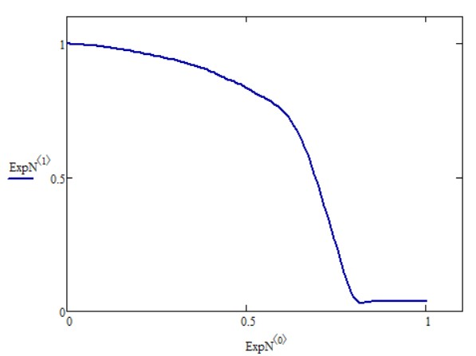

# C++ Genetic Algorithms
AI-based experimental data approximation curve selection.

This project lets you set some experimental data (in a form of two-dimensional graph) and select an approximation curve in a symbolic form - for example, for something like that

The output formula would be v(t)=((((t+0.2)^(8.1)*t+t)^(4.28)*t+t)^2+1.01)^(-0.68) with the final accuracy of 90%

To process symbolic operation an open lib is used.

Go for one-variable formula selection in the source branch or multi-variable version in branch multi_symb.
You can add new input data file with lines like this
'''
datafiles.push_back("Data\\angles\\1.txt");
'''
Variables to be considered:
'''
	Variables.push_back(v);
	Variables.push_back(t);
	Variables.push_back(h);
'''
And their values:
'''
	hValues.push_back(1);
	hValues.push_back(0.5);
	hValues.push_back(0.25);
	hValues.push_back(0.1);
'''
